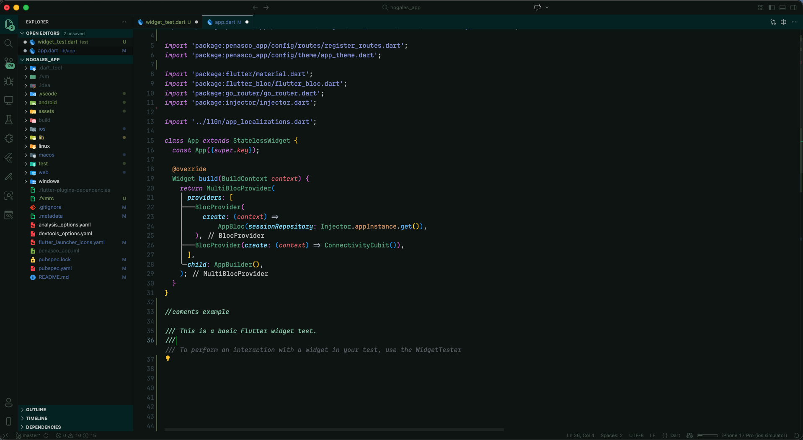

# Material Teal Pro

> A clean, minimal dark theme with a refined teal aesthetic — optimized for Flutter, Dart and modern development workflows.

Material Teal Pro is a carefully tuned dark theme built for developers who love deep backgrounds, soft contrasts and a vibrant teal accent without visual noise.

Designed for long coding sessions.  
Optimized for clarity.  
Minimal. Focused. Professional.

---

## Preview




---

## ✨ Features

- Deep dark editor background (`#0a140f`)
- Clean unified sidebar
- Teal accent activity bar
- Neon green cursor (`#00F5A0`)
- Soft blue strings
- Mint italic comments
- Refined semantic highlighting
- Full language support (Java, PHP, Rust, Dart, JS/TS, Markdown, JSON, and more)
- Optimized contrast for reduced eye strain

---

## 🎯 Optimized For

- Flutter
- Dart
- JavaScript / TypeScript
- Backend development
- Clean architecture projects
- Developers who prefer minimal UI environments

---

## 🎨 Design Philosophy

Material Teal Pro is not just a recolor.

It keeps the full power of the original Material Teal token system while introducing:

- Better visual hierarchy
- Cleaner contrast
- Modern teal accents
- Consistent UI surfaces
- Improved terminal readability

No unnecessary saturation.  
No distracting highlights.  
Just focus.

---

## 🚀 Installation

### From VS Code Marketplace

1. Open **Extensions** (`Ctrl + Shift + X`)
2. Search for **Material Teal Pro**
3. Click **Install**
4. Go to `Preferences → Color Theme`
5. Select **Material Teal Pro**

---

### From Command Palette

1. Press `Ctrl + Shift + P`
2. Type `Color Theme`
3. Select **Material Teal Pro**

---

## ⚙️ Recommended Settings

For the best experience:

```json
{
  "editor.fontLigatures": true,
  "editor.cursorSmoothCaretAnimation": "on",
  "editor.cursorBlinking": "smooth",
  "editor.minimap.enabled": false
}
